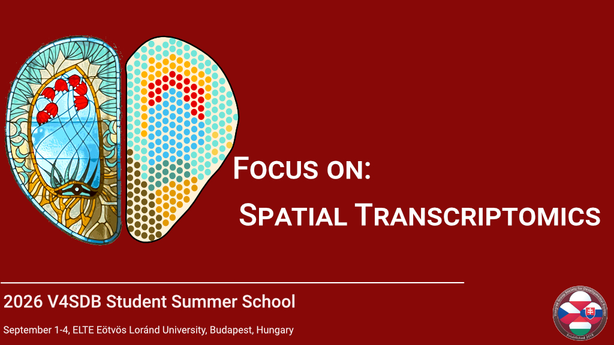
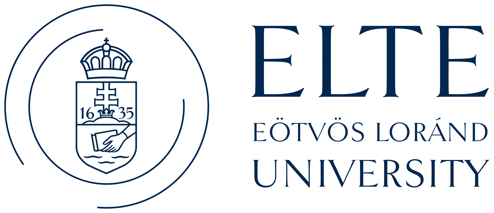

# 2026 V4SDB Student Summer School Information {.unnumbered}

**The course will focus on the analysis of spatial transcriptomics datasets.** During the course we plan to have practical sessions, where the participants will have the opportunity to gain hands-on experience in the *in silico* processing of spatial transcriptomics datasets. 

As part of the course we will also have a **public lecture about the [Human Cell Atlas Project](https://www.humancellatlas.org)**.

If interested, please complete [this application form](https://forms.cloud.microsoft/pages/responsepage.aspx?id=zdtms8NPUUSC0uI5VkMCw04ypxZWF-NMk_jibhQPRDtURTUyTTFESFlQTkNXNkdBOEhQSjVWUE5RUC4u&origin=lprLink&route=shorturl). **Application deadline 21st June 2026.**

Accepted applicants will need to have an active [V4SDB membership](https://www.v4sdb.org/about-us-join), and will be required to pay a **50 EUR registration fee**.

## Confirmed lecturers

- [Enikő Lázár](https://www.kth.se/profile/elazar?l=en) - KTH Royal Institute of Technology
- [Yinan Wan](https://schierlab.biozentrum.unibas.ch/currentmembers) - Biozentrum, University of Basel
- [Jonathan Enriques](https://igfl.ens-lyon.fr/equipes/j-enriquez-development-and-function-of-the-neuromuscular-system) - Institut de Génomique Fonctionnelle de Lyon
- [Konstantin Khodosevich](https://www.bric.ku.dk/research-groups/khodosevich-group/) - BRIC University of Copenhagen

**Organizer:** 

- [Máté Varga](http://danio.elte.hu/index.html) - ELTE Eötvös Loránd University, Budapest, Hungary

## Funding

::: {layout="[[1, 1], [2, 1, 2]]"}

:::