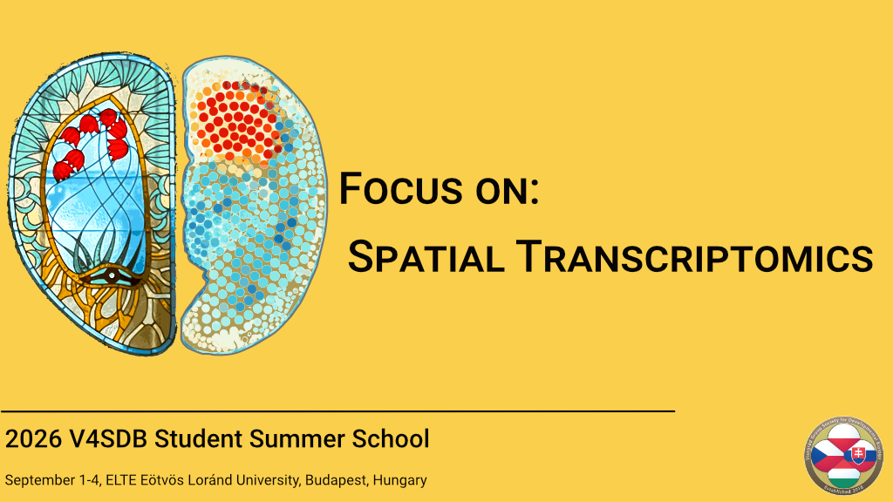

# 2026 V4SDB Student Summer School Information {.unnumbered}

## Watch this space for details (expected in May 2026) 

**Invited speakers:**

- [Enikő Lázár](https://www.kth.se/profile/elazar?l=en) - KTH Royal Institute of Technology
- [Yinan Wan](https://schierlab.biozentrum.unibas.ch/currentmembers) - Biozentrum, University of Basel
- [Jonathan Enriques](https://igfl.ens-lyon.fr/equipes/j-enriquez-development-and-function-of-the-neuromuscular-system) - Institut de Génomique Fonctionnelle de Lyon
- [Konstantin Khodosevich](https://www.bric.ku.dk/research-groups/khodosevich-group/) - BRIC University of Copenhagen

**Organizer:** 

- [Máté Varga](http://danio.elte.hu/index.html) - ELTE Eötvös Loránd University, Budapest, Hungary